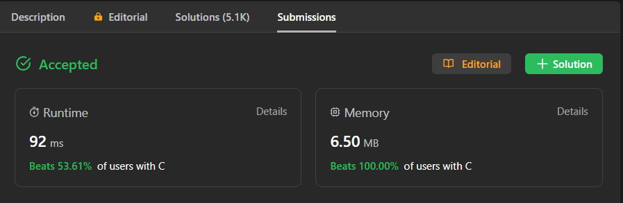
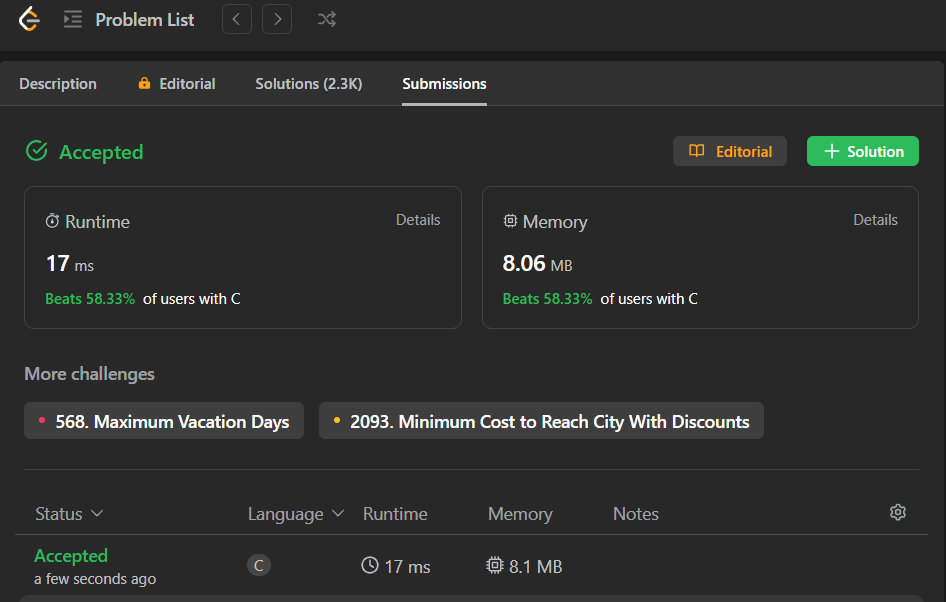
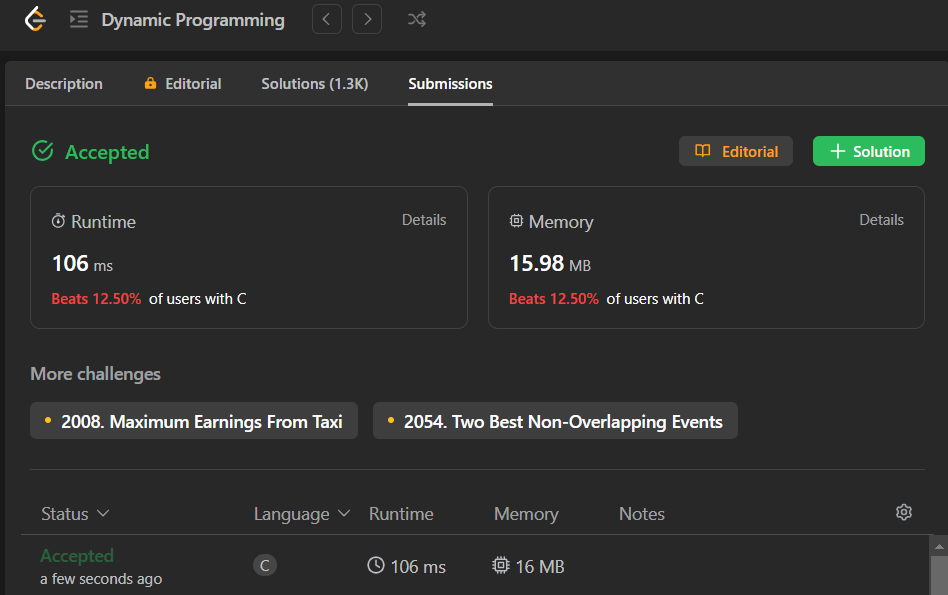

# Exercícios Resolvidos de Juiz Online

Temas:

- PD

## Alunos

| Matrícula  | Aluno                       |
| ---------- | --------------------------- |
| 19/0085045 | Brenno da Silva Oliveira    |
| 19/0087501 | Gabriel Marcolino Rodrigues |

## Sobre

Resolução dos exercícios do LeetCode.

> [300. Longest Increasing Subsequence](https://leetcode.com/problems/longest-increasing-subsequence/) 
> [787. Cheapest Flights Within K Stops](https://leetcode.com/problems/cheapest-flights-within-k-stops/description/) 
> [873. Length of Longest Fibonacci Subsequence](https://leetcode.com/problems/length-of-longest-fibonacci-subsequence/) 
> [1235. Maximum Profit in Job Scheduling](https://leetcode.com/problems/maximum-profit-in-job-scheduling/description/)

## Screenshots

### 300. Longest Increasing Subsequence

### 787. Cheapest Flights Within K Stops

### 873. Length of Longest Fibonacci Subsequence

### 1235. Maximum Profit in Job Scheduling

## Instalação

**Linguagem**: C

## Uso

Para rodar os exercícios basta clonar o respositório

    git clone git@github.com:projeto-de-algoritmos/PD-ExerciciosJuizOnline.git

E executar os seguintes comandos dentro da pasta do arquivo pelo terminal:

    gcc -o nome_arquivo nome_arquivo.c

 

    ./nome_arquivo.exe < nome_arquivo.txt

Outra forma é subtmeter os códigos dos exercícios pelo juiz online:

- [300. Longest Increasing Subsequence](https://leetcode.com/problems/longest-increasing-subsequence/description/)
- [787. Cheapest Flights Within K Stops](https://leetcode.com/problems/cheapest-flights-within-k-stops/description/)
- [873. Length of Longest Fibonacci Subsequence](https://leetcode.com/problems/length-of-longest-fibonacci-subsequence/description/)
- [1235. Maximum Profit in Job Scheduling](https://leetcode.com/problems/maximum-profit-in-job-scheduling/description/)

**Observação**: para os exercícios feitos no LeetCode é necessário submete-los diretamente no juiz online.

## Outros

[Vídeo de apresentação Parte 1](https://youtu.be/q4rip_Xj9OY) 
[Vídeo de apresentação Parte 2](https://youtu.be/14bavongvv4)

